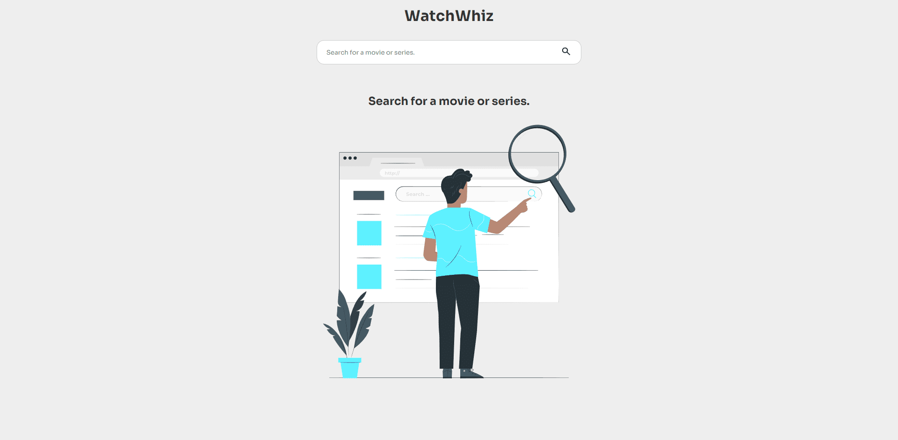

# WatchWhiz 🎬

Bem-vindo ao WatchWhiz, a sua plataforma dedicada a aprimorar a busca pelos seus filmes e séries favoritos! Este projeto representa uma etapa marcante da minha jornada inicial no estudo desta área que eu me apaixonei. Após um tempo dedicado ao aprendizado, decidi refatorar o projeto, mas manter a essência dele, que marca o início da minha jornada nessa área.

## Layout Web

## Layout Mobile

## 🛠️ Tecnologias

💻 **Front-end**

- [React](https://react.dev/)
- [Typescript](https://www.typescriptlang.org)
- [Vite](https://vitejs.dev/)

📚 **Bibliotecas**

- [react-router-dom](https://reactrouter.com/en/main)

🎨 **Estilização**

- [styled-components](https://styled-components.com/)

🔋 **Versionamento e Deploy**

- [Git](https://git-scm.com)

⚙️ **Configuranções e Instalações**

Clone do Projeto

    $ git clone https://github.com/Faelkk/Mycontacts

Instalando as dependências

    $ npm install

Iniciando o projeto

    $ npm run dev

 

**Como me ajudar nesse projeto?**

- Você ira me ajudar muito me seguindo aqui no GitHub
- Dando uma estrela no projeto
- Conectando-se comigo no LinkedIn para fazer parte da minha rede.

 

**Feito por**
[Rafael Achtenberg](linkedin.com/in/rafael-achtenberg-7a4b12284/)
